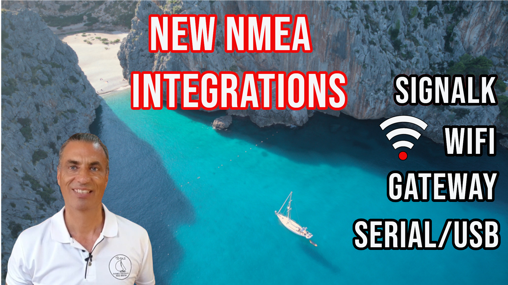

# ha-smart0183tcp

## NMEA 0183 TCP Integration for Home Assistant

The **ha-smart0183tcp** integration lets **Home Assistant** receive real-time **NMEA 0183** data over TCP, enabling you to monitor wind, depth, speed, GPS, and other marine instruments directly in your dashboards. Perfect for **Raspberry Pi**-based central marine computers and boat automation projects.

📖 **General NMEA 0183 article:** [NMEA 0183 – Home Assistant, Wi-Fi, Signal K, and Serial](https://smartboatinnovations.com/nmea-0183-home-assistant-wifi-signal-k-serial/)  
🔗 **Integration setup guide:** [NMEA 0183 TCP integration guide](https://smartboatinnovations.com/code/smart0183-tcp/)  
💡 **Related project:** [Build a Central Marine Computer](https://smartboatinnovations.com/build-central-marine-computer/)  
🌐 **Smart Boat Innovations homepage:** [smartboatinnovations.com](https://smartboatinnovations.com)  

🎥 **Video tutorial:** [Watch on YouTube](https://youtu.be/VxIcNZlDbTI)

---

### About Smart Boat Innovations
I'm Rob, a sailor and tech enthusiast with over 20 years of global sailing experience and a Computer Science degree. At **Smart Boat Innovations**, we focus on open-source marine electronics, **Raspberry Pi**, **ESP32**, **NMEA 0183**, **NMEA 2000**, and **Home Assistant** projects that make boating smarter, safer, and more affordable.

💬 Subscribe to our [YouTube channel](https://www.youtube.com/@SmartBoatInnovations) for more projects, ideas, and tutorials. 

🧭 Join the discussion on [r/smartboating on Reddit](https://www.reddit.com/r/smartboating)

☕ If you’ve found this useful, you can [support my work on Ko-fi](https://ko-fi.com/smartboatinnovations).
