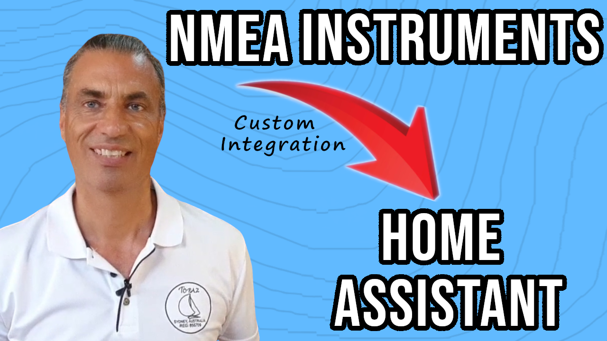

# ha-smart0183tcp

## Smart Boat 0183 TCP Integration

I'm Rob, a seasoned sailor and tech enthusiast dedicated to revolutionizing the boating industry through the integration of accessible technology. With over 20 years of global sailing experience and a Computer Science degree, I am committed to providing you with practical innovations and ideas that will transform your boating experience. At Smart Boat Innovations, we explore the world of boat automation and harness the power of the Internet of Things (IoT) technology.

My philosophy revolves around utilizing free open systems and affordable sensors and equipment. I believe that everyone should have access to these advancements without breaking the bank. While our website https://www.smartboatinnovations.com/ provides valuable insights and information, the majority of our content can be found on our YouTube channel. https://www.youtube.com/@SmartBoatInnovations
I invite you to head over there, subscribe to our channel, and join the vibrant community of boating enthusiasts who are exploring the exciting possibilities of affordable technology.

For instructions on using this ha-smart0183 integration go to https://www.smartboatinnovations.com/smart0183
or watch this video guide: https://youtu.be/9mlTKtD1FFI
